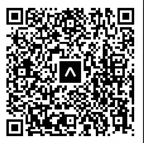
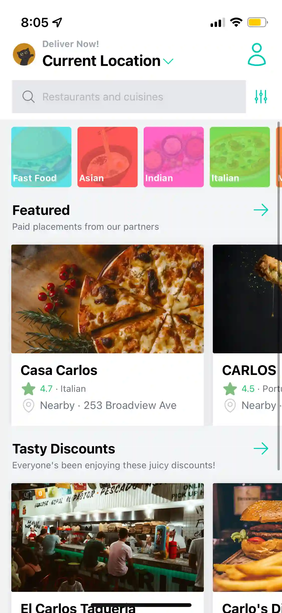
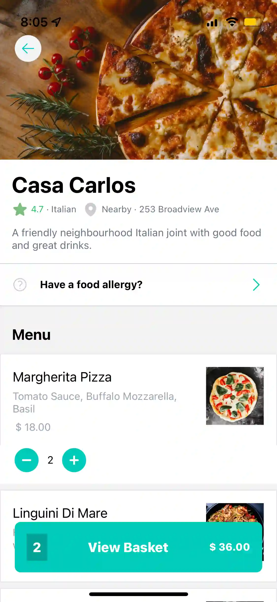
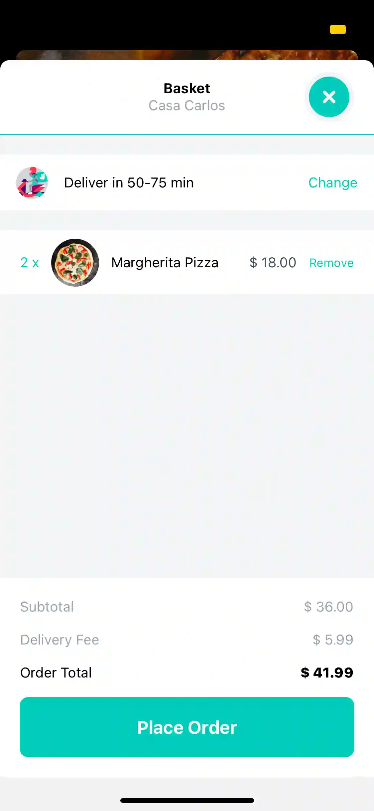

# Food Delivery App

A functional food delivery mobile app created in React Native. This app uses Sanity CLM on the backend to manage the database. 

To try it out, download the Expo Go app and scan the QR code below.

<picture>

</picture>

## Screenshots

## Built With
- [React Native](https://reactnative.dev/)
- [Redux](https://redux.js.org/)
- [Sanity](https://www.sanity.io/)
- [Expo](https://expo.dev/)
- [NativeWind](https://www.nativewind.dev/)
- [React Native Animatable](https://github.com/oblador/react-native-animatablehttps://github.com/oblador/react-native-animatable)
- [React Native Heroicons](https://www.npmjs.com/package/react-native-heroicons)
- [React Native Progress](https://www.npmjs.com/package/react-native-progress)
- [React Native Maps](https://github.com/react-native-maps/react-native-maps)
- 
### Author

- [Mick Maratta](https://www.mickmaratta.me)
